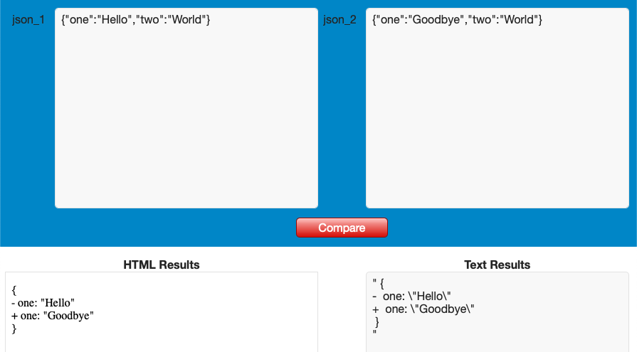
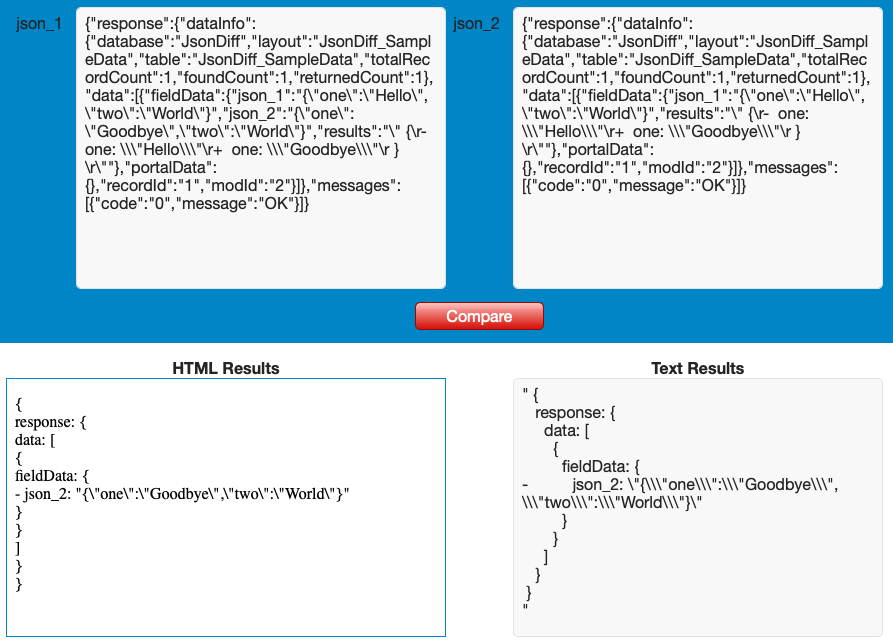

# JsonDiff

#### A FileMaker Pro Add-On

Quickly determine the difference between 2 JSON objects.

#### Points To Ponder

If you use an API to communicate with an external vendor or client in your FileMaker solution, you can use this tool to compare a current JSON API response to a previous one that you might have stored in your database. This tool would reveal what changed.

You could use the native FileMaker (v19.0 or newer) function "Execute FileMaker Data API" to query the database for a set of records, and using this tool, compare the JSON results to a previous or additional query.

Comparing two large JSON objects will be much faster using this tool, versus writing a FileMaker Script to loop thru the JSON objects to find the differences.

#### Installation

1. Download "JsonDiff.fmaddon"

2. Double-click the downloaded file to open FileMaker Pro and it will be automatically installed into the correct directory

3. Open or create the database you wish to add "JsonDiff" to

4. Create a new, empty "Form" layout

5. In Layout mode, make sure that you have the left side "Objects" pane visible, and click on the "Add-ons" tab

6. Click on the Add "+" button (lower right of pane)

7. Scroll thru the list of possible Add-Ons and select "JsonDiff" and click "Choose" button

8. Drag newly added Add-On icon over into the layout body

9. Add-On has now been installed, adding the following:
  * 2 new Scripts: "JsonDiff ( $json1 ; $json2 )" & "JS_Result_Handler ( results )"
  * "JsonDiff_SampleData" Table with 8 Fields and 2 Records
  * 1 new Layout: "JsonDiff_SampleData"

#### Usage

1. Enter your two JSON objects into the 2 provided fields

2. Click on the provided button "Compare" to run the comparison

3. The results will be returned in 3 ways:
  * HTML format inside the "HTML Results" webViewer
  * Text/String format inside the "Text Results" text field
  * Global variable "$$JS.JSON_DIFF.RESULTS"

#### Dependancies

This Add-On uses the Javascript Library "json-diff" (https://www.npmjs.com/package/json-diff)

This Add-On is completely self contained and all the required Javascript Library data has been stored locally in the Add-On.
